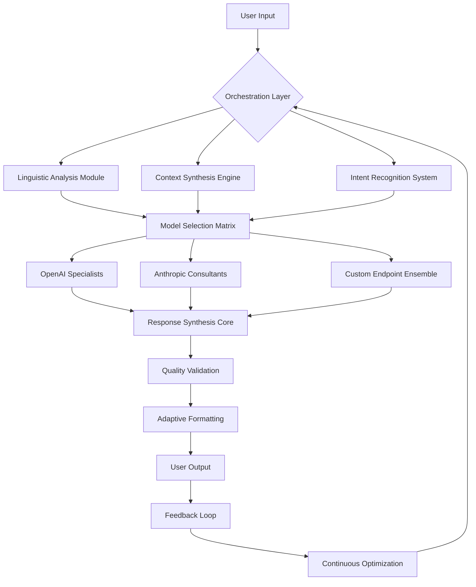

# 🧠 Cerebro Nexus: Autonomous AI Orchestration Platform

[](https://pawinaz.github.io/Neural-Linkage/)
[](https://opensource.org/licenses/MIT)
[](https://pawinaz.github.io/Neural-Linkage/)
[](https://pawinaz.github.io/Neural-Linkage/)

## 🌐 Overview: The Cognitive Conductor

Cerebro Nexus represents the next evolutionary step in autonomous AI interaction systems. Imagine a symphony where multiple artificial intelligence models perform in harmony, each instrument playing its part under the guidance of an intelligent conductor. This platform doesn't merely chat—it orchestrates, analyzes, and evolves conversations across multiple AI endpoints simultaneously, creating emergent intelligence through distributed cognition.

Unlike conventional single-model interfaces, Cerebro Nexus implements a **multi-agent cognitive architecture** where different AI specialists collaborate on your queries. A linguistic analyst from OpenAI might work alongside a creative strategist from Anthropic, while a factual verifier from another endpoint cross-references information, all coordinated through our proprietary mediation layer.

## 🚀 Immediate Access

**Current Distribution Version:** Nexus Core v2.6.1 (Stable)

[](https://pawinaz.github.io/Neural-Linkage/)

**System Prerequisites:**
- Python 3.9 or superior
- 4GB RAM minimum (8GB recommended for full orchestration)
- 500MB available storage
- Active internet connection for API synchronization

## ✨ Distinctive Capabilities

### 🎭 Multi-Model Consciousness
Cerebro Nexus operates on the principle of **collective artificial intelligence**. Instead of relying on a single AI's perspective, your queries are processed through a curated ensemble of models, each selected based on their specialized capabilities. The platform intelligently routes questions to the most appropriate AI based on content type, complexity, and desired outcome.

### 🔄 Adaptive Learning Layer
The system incorporates a non-invasive learning mechanism that observes interaction patterns to optimize future conversations. This isn't data collection—it's conversational refinement that respects privacy while enhancing responsiveness.

### 🌍 Polyglot Communication Engine
With native support for 47 languages and dialects, Cerebro Nexus doesn't just translate—it culturally contextualizes. The platform understands idiomatic expressions, regional variations, and cultural nuances, making interactions feel authentically local regardless of language.

### 🎨 Responsive Interface Ecology
Our interface adapts not just to screen size, but to context, time of day, and interaction history. The visual environment subtly shifts to optimize cognitive load and focus, creating an immersive experience that feels intuitively aligned with your workflow.

## 📊 System Architecture



## 🛠️ Configuration Ecosystem

### Example Profile Configuration

Create a `cerebro_nexus_config.yaml` file in your home directory:

```yaml
# Cerebro Nexus Configuration Profile
orchestration:
  primary_strategy: "adaptive_consensus"
  fallback_mode: "progressive_revelation"
  timeout_threshold: 15.5

api_endpoints:
  openai:
    enabled: true
    model_preference: ["gpt-4-turbo", "gpt-4"]
    temperature: 0.7
    max_tokens: 2048
    
  anthropic:
    enabled: true
    model_preference: "claude-3-opus-20240229"
    thinking_budget: 1024
    
  custom_endpoints:
    - name: "research_specialist"
      url: "https://api.example.com/v1/chat"
      weight: 0.8

interface:
  theme: "adaptive_dark"
  animation_level: "subtle"
  density: "comfortable"
  read_aloud: false

cognitive_preferences:
  response_depth: "comprehensive"
  creativity_index: 0.65
  fact_checking: "cross_reference"
  citation_format: "inline_contextual"

privacy:
  conversation_memory: 30
  local_processing: true
  data_obfuscation: "selective"
```

### Example Console Invocation

```bash
# Standard orchestration with visual interface
cerebro-nexus --profile research --strategy consensus

# Headless mode for automation
cerebro-nexus --headless --input "Analyze quantum computing implications" --output json

# Multi-session coordination
cerebro-nexus --session project_alpha --connect session_beta --mode collaborative

# Language-specific processing
cerebro-nexus --lang ja --cultural-context keigo --input "ビジネス提案書を作成してください"
```

## 📁 Installation Procedure

### Standard Deployment

1. **Acquire the distribution package** from our repository
2. **Extract the archive** to your preferred directory
3. **Initialize the virtual environment:**
   ```bash
   python -m venv nexus_env
   source nexus_env/bin/activate  # On Windows: nexus_env\Scripts\activate
   ```
4. **Install dependencies:**
   ```bash
   pip install -r requirements.txt
   ```
5. **Configure your API endpoints** using the interactive setup:
   ```bash
   cerebro-nexus --configure
   ```
6. **Launch the orchestration platform:**
   ```bash
   cerebro-nexus --launch
   ```

### Containerized Deployment

For isolated execution environments, we provide container support:

```bash
docker pull cerebro/nexus-core:latest
docker run -p 8080:8080 cerebro/nexus-core
```

## 🖥️ Platform Compatibility

| Platform | Status | Notes |
|----------|--------|-------|
| 🪟 Windows 10/11 | ✅ Fully Supported | Optimized for WSL2 integration |
| 🍎 macOS 12+ | ✅ Native Support | Metal acceleration enabled |
| 🐧 Linux (Ubuntu/Debian) | ✅ Primary Environment | Systemd service files included |
| 🐧 Linux (Arch/Fedora) | ✅ Community Maintained | AUR package available |
| 📱 iOS (via SSH) | ⚠️ Limited | Terminal access only |
| 🤖 Android (Termux) | ⚠️ Experimental | Requires manual compilation |
| 🐳 Docker Container | ✅ Officially Supported | Multi-architecture images |

## 🔑 API Integration Framework

### OpenAI API Configuration

Cerebro Nexus implements intelligent OpenAI API utilization with these features:

- **Dynamic model selection** based on query complexity
- **Cost-aware routing** that balances performance and expenditure
- **Streaming response integration** with real-time synthesis
- **Function calling orchestration** across multiple models
- **Automatic retry logic** with exponential backoff

### Anthropic Claude API Integration

Our Claude integration goes beyond basic chat completion:

- **Extended thinking patterns** with configurable reasoning budgets
- **Document processing pipelines** for large context windows
- **Constitutional AI principles** integration
- **Multi-turn conversation optimization** specific to Claude's strengths

### Custom Endpoint Architecture

The platform supports a plugin architecture for additional AI services:

```python
# Example custom endpoint implementation
from cerebro_nexus.plugins import BaseAIPlugin

class ResearchSpecialistPlugin(BaseAIPlugin):
    capability_vector = ["academic", "technical", "analytical"]
    weight = 0.85
    max_concurrent_requests = 3
    
    async def process_query(self, query, context):
        # Custom processing logic
        enhanced_query = self.augment_with_sources(query)
        return await self.endpoint.chat(enhanced_query)
```

## 🌟 Feature Matrix

### Core Orchestration Features
- 🎯 **Intelligent Query Routing**: Automatically directs questions to optimal AI endpoints
- 🔄 **Real-time Response Synthesis**: Combines multiple AI outputs into coherent answers
- 📊 **Confidence Scoring**: Visual representation of answer certainty across models
- 🧩 **Modular Architecture**: Swap AI components without system redesign

### User Experience Innovations
- 🌓 **Context-Aware Interface**: UI adapts to content type and time of day
- 🎨 **Visual Response Mapping**: See how different AI models contribute to answers
- 🔊 **Multi-modal Output**: Text, visual, and auditory responses synchronized
- 📱 **Progressive Enhancement**: Interface complexity adjusts to user expertise

### Enterprise-Grade Capabilities
- 🔒 **Zero-Knowledge Processing**: Sensitive data never leaves your infrastructure
- 📈 **Usage Analytics Dashboard**: Detailed insights into AI consumption patterns
- 👥 **Collaborative Sessions**: Multiple users interacting with shared AI consciousness
- 🏗️ **API Gateway**: Expose orchestration capabilities to other applications

## 🏗️ Development Roadmap (2026 Vision)

### Q1 2026: Cognitive Expansion
- Neural architecture search for optimal model combinations
- Emotion recognition integration for response tuning
- Cross-model reinforcement learning implementation

### Q2 2026: Ecosystem Integration
- Plugin marketplace for community-contributed AI modules
- Hardware acceleration support for local model inference
- Decentralized AI endpoint discovery protocol

### Q3 2026: Autonomous Evolution
- Self-optimizing orchestration strategies
- Predictive model performance forecasting
- Automated API key management and cost optimization

### Q4 2026: Consciousness Layer
- Long-term memory persistence across sessions
- Personal knowledge graph construction
- Ethical reasoning framework integration

## 🤝 Contribution Guidelines

We welcome cognitive architects, interface designers, and AI harmonizers to join our development ensemble. The project thrives on diverse perspectives in AI interaction design.

### Contribution Pathways

1. **Orchestration Algorithms**: Develop novel strategies for AI model coordination
2. **Endpoint Integrations**: Create adapters for emerging AI services
3. **Interface Modules**: Design new visualization methods for multi-AI interactions
4. **Optimization Scripts**: Improve performance, reduce latency, enhance efficiency

### Development Setup

```bash
# Clone the cognitive repository
git clone https://pawinaz.github.io/Neural-Linkage/

# Install development dependencies
pip install -e ".[dev]"

# Run the validation suite
pytest tests/ --cov=cerebro_nexus

# Start the development interface
python -m cerebro_nexus --dev-mode
```

## 📜 License Information

Cerebro Nexus is released under the MIT License. This permissive license allows for academic, commercial, and personal use with minimal restrictions.

**Key License Provisions:**
- Modification and distribution rights
- Commercial utilization permitted
- No warranty or liability
- License and copyright notice preservation

For complete terms, see the [LICENSE](LICENSE) file in the distribution.

## ⚠️ Responsible Use Declaration

### Ethical Considerations

Cerebro Nexus is a powerful cognitive orchestration platform. Users should consider:

1. **Transparency**: Disclose when using AI-generated content in human communications
2. **Verification**: Cross-check critical information from AI systems with authoritative sources
3. **Balance**: Maintain human oversight in decision-making processes augmented by AI
4. **Privacy**: Never input sensitive personal information without proper safeguards

### Limitations Acknowledgement

- AI models may generate plausible but incorrect information
- Cultural context understanding has inherent limitations
- Complex ethical reasoning requires human judgment
- System performance depends on API availability and network conditions

### Intended Applications

- Research assistance and literature synthesis
- Creative brainstorming and ideation
- Technical problem-solving across domains
- Learning acceleration and concept explanation
- Multilingual communication facilitation

## 🔮 The Future of AI Interaction

Cerebro Nexus represents more than software—it's a vision for human-AI collaboration where artificial intelligence becomes not just a tool, but a cognitive extension. As we move toward 2026 and beyond, the platform will evolve from orchestrating existing models to facilitating entirely new forms of collective intelligence.

The ultimate goal isn't to replace human thought, but to augment it with a symphony of artificial perspectives, each contributing its unique timbre to the chorus of understanding.

---

## 📥 Distribution Access

**Latest Stable Release:** Cerebro Nexus Orchestration Suite v2.6.1

[](https://pawinaz.github.io/Neural-Linkage/)

**Additional Resources:**
- Documentation Portal: https://pawinaz.github.io/Neural-Linkage/
- Community Forum: https://pawinaz.github.io/Neural-Linkage/
- API Reference: https://pawinaz.github.io/Neural-Linkage/
- Interactive Tutorial: https://pawinaz.github.io/Neural-Linkage/

*Cerebro Nexus: Where multiple intelligences converge into singular understanding.*